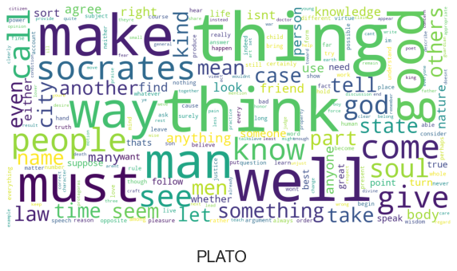
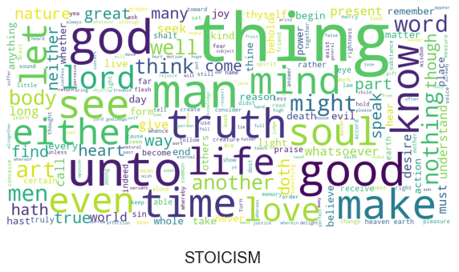
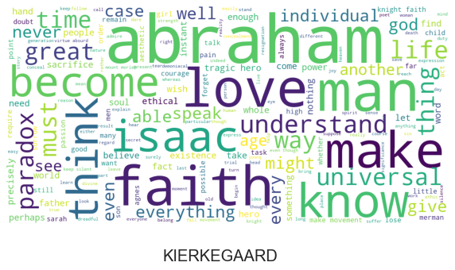
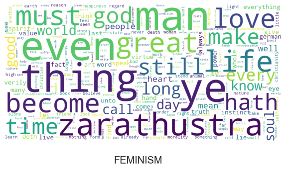
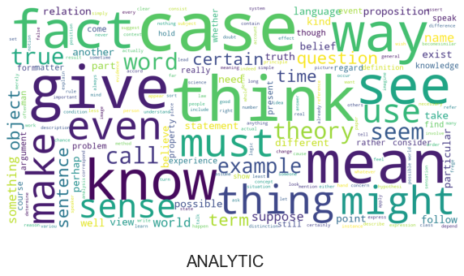

### Silvia (Vasiliki) Vlachou (vv2340)

# Evolution of Philoshopical Ideas

Philosophy comes from the greek words *“philo”* (love) and *“sophia”* (wisdom). The study of philosophy is of enormous interest, since its evolution reflects the evolution of ideas, beliefs, and the human existence in general. So, we are going to discuss the evolution of philosophy over time. Our goal is to eventually answer the following questions:
- Which are the main ideas and characteristics of each school of thought?
- Are there similarities between different schools?
- How have people’s emotions towards specific topics (e.g., god, mind, soul) changed over time?

### Data

At this point, it should be mentioned that for our analysis we used the dataset from the [Philosophy Data Project](http://philosophydata.com/index.html).
The dataset contains 396,427 sentences from over 69 texts spanning 18 major schools of philosophy. The following schools are represented: plato, aristotle, empiricism, rationalism, analytic, continental, phenomenology, german_idealism, communism, capitalism, stoicism, nietzsche, feminism, scholasticism, Kierkegaard, Hobbes, Existentialism, Daoism.

### Initial analysis

Although the story of philoshopy starts hundrends of years before Christ, the first philosophical texts in this dataset are from 350BC, when the Greek philosopher Plato founded a school of thought that is named after him. From the following graph it is evident that there is a huge decrease in the number of philosophical publications around the Middle Ages, which makes sense considering that at that time life was particularly hard. After the onset of Renaissance, philosophy started burgeoning again with multiple schools being founded.

Given that multiple schools and philosophers are represented in the dataset, it would be interesting to understand which are the schools that have produced the most work in terms of number of texts and how many authors are part of each school.  

The following graphs show the number of authors per school, the number of texts per school, and the number of texts per author. It is clear that the schools that are represented by just one author have procuded only one text with the exception of nietzsche. This makes sense considering that some schools that have the name of the a specific philosopher (e.g., the Plato and Aristotle schools) refer to the philosophical positions of a single person.

Given that Plato -the founder of the Plato school of philosophy- has largely contributed to the idea of Laconian speech (i.e., brevity or terseness of expression), it would be interesting to perfrom an analysis on the lenght of the sentences per school to see whether there is a trend on the level of laconism.  

As shown in the following graph, the plato school of thought -that is actually the oldest one- indeed has a quite low average sentence length. At the same time, Hobbes has the largest average sentence length, which makes sense considering that Hobbes was very expressive, with the core of his conception of language being the possibility of creating things with words.  

If we take into consideration the period of time each philosophical school spans (oldest: plato, most recent: analytic, continental, feminism), we can safely conclude that there is no correlation between the time period and the level of laconism.

### Data preprocessing

Before analyzing the data and trying to answer the questions mentioned in the beginning of this blog, it is important to perform data cleaning and make the content suitable for our analysis.  

For the purposes of this project, it was decided that the following cleaning should be performed - using `nltk`:
- all punctuation marks should be removed  
- all english stopwords as well as some words (e.g., list, say, one, therefore) that are used many times in the texts but do not add value to the analysis from a philosophical point of view should be removed
- the sentences should be tokenized and lemmatized. Since our analysis is heavily based on the most used words in each text/school, we need to use lemmatization to do morphological analysis and group together the different forms of a word so that they can be analyzed as a single item. Although the creator of the dataset has tokenized and lemmatized the sentences, we decided to redo that processing for data integrity.

### Wordclouds

Let's now try to understand the main ideas and characteristics of each school of thought as well as the differences in thought and positions between the schools. To do so we will figure out the words that are the most frequent in the texts representing each school. Having removed some very common words -known as stopwords- we expect to encounter meaningful words that are indicative of the philosophical ideas of each school.

The following wordclouds are visual representations of the most common words in the texts of each school, where the size of the fonts indicates the importance of the word. The wordclouds showcase the differences between schools, not only in terms of ideas but also in terms of writing style.

  
  

  
  

  
  

  
  

  
  

  
  

  
  

  
  

Let's now discuss the idea behind each school as revealed by the wordcloud and compare it with our knowledge about the respective philosophical view. We will discuss the schools in chronological order.

- Plato: Some of the most used words are think, man, good, well, even, and give. Plato, the founder of the plato school was an advocate of justice, which is exactly what these words indicate.
- Aristotle: Some of the most used words are animal, man, body, reason, case, and cause, words that indicate rationality. Aristotle was indeed a supporter of reasoning. 
- Daoism: tao and heaven underline harmony and natural order. At the same time, sage and people could indicate patience and compassion towards the others.
- Stoicism: as indicated by the wordcloud the main ideas of stoicism are wisdom (mind), justice (truth), and courage (soul).
- Hobbes: exist, existence, freedom, order, relation, commonwealth underline Hobbes's concern: the sociopolitical problem, i.e., how can people live together in communities peacefully?
- Rationalism: Some of the most common words are mind, idea, know, reason, and think. The usage of these words bolsters the idea that all aspects of life can be grasped through logical principles.
- Empiricism: Words such as idea, body, object, reason, make, and produce indicate evidence, experience. That is exactly what empiricism is about, the idea that all concepts originate in experience.
- German idealism: concept, consciousness, determination, think, reason and nature are words commonly used among the german idealists. If we compare these words to the ones used in empiricism we can understand that german idealism contradicst empriricsm by supporting that all knowledge comes from the mind.
- Capitalism: some of the most common words are capital, money, tax, proffit, pay, and interest. All these words underline that capitalism's ideas are private property, profit, and market compettion.
- Kierkegaard: words like faith, abraham, isaac, love, god, man reveal the belief that people should have total faith in god.
- Communism: words like work, worker, hand, machinery, and labourer refer to the working class, the proletariat as called in communism. On the ther hand, capital opposes to capitalism.
- Nietzsche: Good, virtue, and great are some of the dominant words in the texts of the nietzsche school. That could mean that the philosophers of that schools wrote extensively about good and probably about evil as well. Man, life, mind, god support the concept of self-realization and the idea that god does not exist.
- Phenomenology: think, experience, consiounsness, sense, perception. All these words reveal that phenomenology studies phenomena that have been experienced consciously.
- Feminism: this school of philosophy strived to not only understand but also challenge women's oppression as revelaed by words such as even, become, and zarathustra.
- Analytic: think, case, know, fact, theory, and question show that the philoshopers of the analytic school were supporters of logic and reasons. At the same time, the words term, word, and sentence reveal that the analytic school is characterized by an emphasis on linguistics. 
- Continental:  this school of thought is all about politics, desire, and freedom as indicated by the words form, man, must, order, and relation.

Besides the difference in some ideas behind each school of philosophy, how do these schools differ in terms of writing style? It is clear that the philosopers of the older schools used words that are now antiquated.

So **what are some of the main philosophical categories**? idealism, rationalism, religion, sociopolitics, capitalism vs communism, feminism

### Topic Modeling

Now that we have figured out the main ideas of each school, we should try to fully understand the ideas they have in common. To do so, we will use topic models, a type of statistical language model that is used to reveal hidden structure in collection of documents. In this case, we will use topic modeling (by using `LatentDirichletAllocation` from `sklearn`) to perform tagging, namely to identify abstract “topics” that occur in the colection of all the philosophical texts.

After experimenting with multiple topic numbers as well as parameters for the `CountVectorizer`, we fit the LDA model using 6 topics. 

The following figures show:
- the first 8 words of each topic.
- The heatmap indicates the similarity score between each topic and each school of philosophy. 

  
  

The heatmap indicates the similarity score between each topic and each school of philosophy. Some schools have nonzero similarity scores with more than one topic, because our model classified some of the respective texts in different classes. Although overall the classification makes sense, some schools (e.g., feminism, kierkegaard) have been misclassified. However, it is clear that the most schools touch upon the same topics, namely rationalism (reason, concept), consciousness (self, consciousness), human nature (body, man, part, nature).

### Sentiment Analysis

From our so far analysis, we can reason that there are topics (e.g., labor, reason, mind, soul) that characterize some of the schools. However, although some philoshophers are in favor of some of those topics some others are against them. For example, Kierkegaard supports the idea that people should have total faith in god, while the Nitzsche school is of the opinion that god doesn't exist. So, wouldn't it be interesting to figure out how the philosophical stance or else the emotions of the philosophers towards those topics have changed over time?

Emotions are associated with thoughts, feelings, and behavioral responses. The evolution of the world, causes people to respond in different way to the same topics during the course of the time. One would wonder: how can we understand how people’s emotions towards specific topics (e.g., god, mind, soul) have changed over time? By performing sentiment analysis and classifying prominent words into emotion categories (categories: Happy, Angry, Surprise, Sad, Fear) using the `text2emotion` package.

The following figures show how the philosophers of each school react towards the topics *mind, reason, soul, god, labor, and woman*. The schools are presented in chronological order.

    
    

    
    

    
    

Since many schools of philosophy touch the ideas of god, mind, reason, and essentially also labor, we should take a close look at the respective barplots and try to interpret them.  

Regarding *reason*, we cannot say that there is a clear trend. During the time of certain schools of thought, e.g., rationalism, reasoning was the main idea. However, we can see that the dominant emotions were fear and sadness, which means that people were not particularly happy and actually quite sad by the idea that all aspects of life can be explained through logical reasoning. At the same time we can see that they were pretty surprised by all the philosophical explanations about the *mind*. Rationalism, Germal Idealism, and Analytic put the mind at the center of behavior. The evolution of philosophy and neuroscience revealed surprising facts about the brain that could cause excitement but also fear.

Let's now talk about *labor*: from the above barplot we observe that overall the negative emotions towards *labor* become more and more dominant over the course of the time. In the past and especially in the very distant past, philoshopers had a more positive attitude towards labor. 

From the barplot that corresponds to *god* we can observe that especially in the case of capitalism there were only negative and somewhat neutral (surprise) feelings about god. This makes sense considering that in capitalism in a sense the economists play the role of god. We can also notice that there is a trend as far as happiness is concerned. Overall, there is a decrease in happiness which confirms that people have started distancing themselves from god.

An idea worth exploring would be to calculate the change in sentiment (positive, negative) for each school. Which schools would we expect to go from net positive to net negative and reverse? We will discuss this in the next blog post!

### Conclusions

In this blog post we talked about the different schools of philosophy -their main ideas and similarities- as well as the evolution of the ideas around the mind, the reason, the labor, and the god over time. Now we are a little bit better equipped to compare historical texts and ideas to contemporary ones (coming from books, articles, or even social media posts) in an attempt to understand the core beliefs people share these days. And maybe such a comparison will be the idea behind a future post!

### *Potential Issues*

The following issues should be taking into consideration when reading the blog.
- Different schools have different number of texts and different number of total words. Consequently, it is possible that we do not have sufficient data for some schools of philosophy.
- Although excited about the opportunity to further explore the evolution of philosophy, I still have very much to learn. The preprocessing and analysis of the data would certainly benefit from expertise in this field. For example, when removing stopwords, I encountered words that at first seems insignificant, such as "must". However, what if in the world of philosophy "must" is an important word denoting submission or command?
